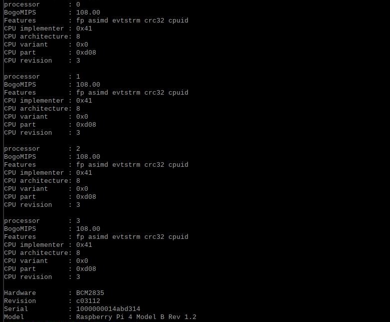
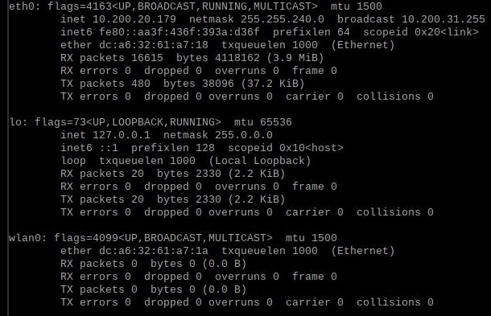
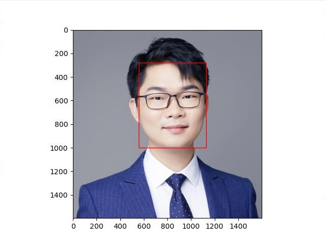

# Intelligent IoT Home Security System

#### Disclaimer: We had code across many devices, and we compiled the more relevant information into this repository.

## Summary
* Engineered a robust IoT network, incorporating advanced cryptographic measures for enhanced data integrity and confidentiality. Leveraged cloud services and mobile interfaces to facilitate intelligent access control and provide real-time user notifications. Utilized AWS IoT core and MQTT protocol’s publisher/subscriber methodology to streamline secure, efficient communication.
* Implemented state-of-the-art object detection and facial recognition models using Inception ResNet and EfficientNet architectures on Raspberry Pis. Automated real-time identity verification and access decisions by cross-referencing detected identities with an AWS SQL server database.
* Established communication between various components including Raspberry Pi edge nodes, NVIDIA Jetson Nano sink node, AWS Lambda functions, and user’s mobile devices, while managing a solenoid lock mechanism via relay signals to ensure secure and efficient system functionality.

## Setup
#### Raspberry Pi Configuration

    
    

## Face Detection 
#### Cropping and Bounding

    
    

## Object Detection

#### Academic Integrity: 

§ 1‑401 POLICY STATEMENT; APPLICATION; DEFINITIONS
Policy Statement. The university has the responsibility for maintaining academic integrity so as to protect the quality of education and research on our campus and to protect those who depend upon our integrity.
Expectations of Students. It is the responsibility of each student to refrain from infractions of academic integrity, from conduct that may lead to suspicion of such infractions, and from conduct that aids others in such infractions. Students have been given notice of this Part by virtue of its publication. Regardless of whether a student has actually read this Part, a student is charged with knowledge of it. Ignorance is not a defense.
Expectations of Instructors. It is the responsibility of each Instructor to establish and maintain an environment that supports academic integrity. An essential part of each Instructor’s responsibility is the enforcement of existing standards of academic integrity. If Instructors do not discourage and act upon violations of which they become aware, respect for those standards is undermined. Instructors should provide their students with a clear statement of their expectations concerning academic integrity.
Application. This Part contains the procedures for addressing course-based academic integrity infractions, including proficiency tests taken after enrollment, for all courses as well as academic integrity infractions in non-course-based degree requirements such as qualifying examinations. This Part does not apply to students enrolled in the degree programs with the Carle Illinois College of Medicine, the College of Veterinary Medicine, and the College of Law, each of which have their own policies. This Part also does not apply to pre-enrollment infractions (see § 1-301 and § 1-303) or infractions of the Academic Integrity in Research and Publications Policy.
Definitions. For purposes of this Part, the following definitions shall apply:
Appeal Manager. The administrator to whom the Appellant submits the Notice of Appeal and who is responsible for overseeing the appeal process. For department-level appeals, the Executive Officer is the Appeal Manager. For college-level appeals, the Dean is the Appeal Manager.
Appellant. A student who submits a Notice of Appeal in accordance with these procedures.
Business Day. Monday through Friday, excluding university and campus holidays and reduced service days.
Consultant. A person with whom a student or Instructor may privately consult during the process. A Consultant may attend hearings with a student or Instructor, but may not participate in the hearings, and may not serve as a witness. Each participant may be accompanied by only one Consultant.
Dean. The dean of the college or head of the equivalent academic unit in which a course or examination is conducted or their designee.
Executive Officer (EO). The executive officer or head of the department or unit in which a course or examination is conducted or their designee.
Instructor. A faculty member or authorized staff member who supervises any academic endeavor.
Notice. A written communication conveying information to or from a participant in the process. E-mail notices are strongly encouraged.
Record. The Instructor’s Allegation Notice, written student Response, any materials relied upon by the Instructor to make the Instructor’s decision, and the Instructor’s Decision Notice.
